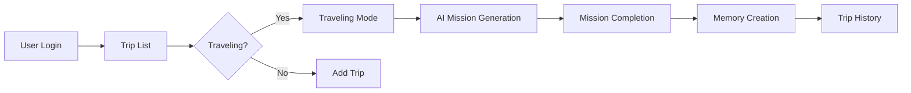

# Bravication
### 2025-APAC-SolutionChallenge-Braves

> Revolutionizing travel through location-based personalized missions and gamified experiences

## Overview

**Bravication** is an innovative travel application designed to tackle the growing problem of overtourism while providing travelers with unique, personalized experiences. By combining location-based recommendations with gamified challenges, we break tourists out of their comfort zones and disperse crowds from hotspots.

## What Makes Us Special?

### Location-Based Recommendations
Service creates new missions based on the current location, helping users have a more instant experience.

### Gamified Tourism Solution
Gamified challenges break tourists out of comfort zones, dispersing crowds from overtourism hotspots while fostering authentic local connections through personalized, location-based missions.

### Unique Selling Point
Dynamic, never-repeated experiences tailored to your exact location and preferences - not just the same recommendations everyone else gets.

## Key Features

### Smart Mission Generation
Personalized challenges based on your preferences, frequency, and current location.

### On-Demand Mission Creation
Generate additional missions anytime you're ready for more adventure.

### Memory Lane
Relive your brave moments through photo-based mission history.

## Architecture

Our application is built on a robust **Google Cloud Platform** architecture:

- **Frontend**: Flutter (Android)
- **Backend**: Google Cloud Run with serverless functions
- **Database**: Cloud SQL (MySQL)
- **AI Engine**: Gemini AI for smart mission generation
- **Authentication**: Google OAuth2
- **Storage**: Cloud Storage
- **Notifications**: Firebase Cloud Messaging (FCM)

### Tech Stack

| Category | Technologies |
|----------|-------------|
| **Client** | Flutter |
| **Server** | Firebase, Google Cloud Platform |
| **AI/ML** | Gemini AI, Vertex AI |

### Additional Technologies
- **Google Cloud Run** - Serverless container platform for scalable backend services
- **Grounding with Search Augmentation** - Enhanced fact-based responses using real-time web search integration
- **Vertex AI** - Machine learning pipeline for personalized mission recommendations
- **Google Maps Platform** - Location-based services and real-time geospatial data
- **Gemini AI** - Advanced AI for generating location-specific challenges and cultural insights

## App Flow

## Addressing 2025 Travel Trends

Many people travel and receive the same route recommendations through web surfing, AI recommendations, blog recommendations, etc., experiencing identical journeys. Bravication addresses this by offering new experiences and new challenges, becoming a new travel trend for 2025.

Our solution provides users with new experiences by offering them fun or challenging missions based on their location while they are traveling.

## Mission

To revolutionize tourism by:
- **Reducing overtourism** through intelligent crowd dispersal
- **Enhancing local experiences** with personalized challenges
- **Creating lasting memories** through gamified exploration
- **Connecting travelers** with authentic local culture

## Impact

- Promotes sustainable tourism practices
- Supports local businesses and communities
- Reduces environmental impact of mass tourism
- Creates unique, memorable travel experiences

## Team Braves

**Team Leader**: Donghyeon Kim  
**Challenge**: Tourism  
**Organization**: GDG on Campus, Dongguk University

## Links

For more information and updates, please contact us through the GDG on Campus Dongguk University.

---

*If there's any question, please kindly ask. Let's Discuss*

## License

This project is part of the 2025 APAC Solution Challenge.

---

*Built with love by Team Braves*
